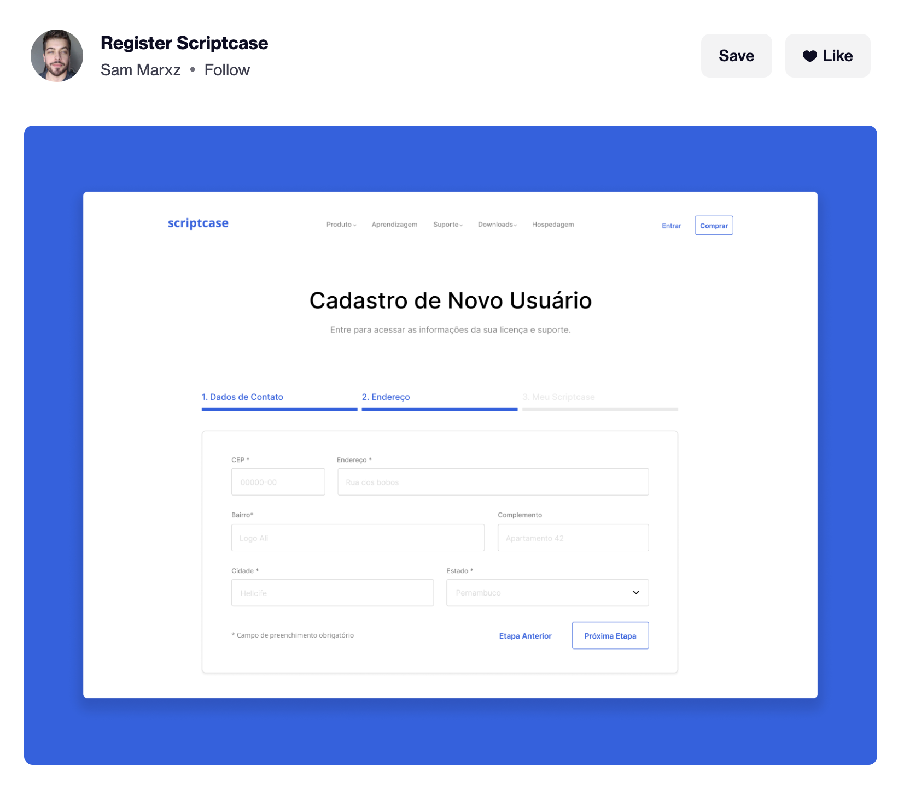

# Frontend Quickbytes: Reallife Inspired Challenges (Total: 8)

This repository contains real life frontend challenges which you can use to practice frontend! You can use any framework/library to solve these challenges. These are created for the fun and practice purpose to go beyond to-dos.

If you like these challenges, would appreciate getting a star to this repository 🌟

You can also contribute to these challenge lists or share your solutions. We can create a solutions section too for those links!

Here is the list of all challenges -

1. [**Smart Textarea**: Twitter like textarea with character count](#smart-textarea)
2. [**Dropdown Component with select/multiselect feature** - Similar to React Select](#dropdown-component)
3. [**Autosuggest Input**](#autosuggest-input)
4. [**Manage cookies pop-up**](#manage-cookies-pop-up)
5. [**Progress Bar**](#progress-bar)
6. [**Scroll and Fix it!**](#scroll-and-fix-it)
7. [**Password Module**](#password-module)
8. [**Multi-step Forms**](#multi-step-forms)
9. [**Back To Top Button**](#back-to-top-button)
10. [**Toggle Sidebar**](#toggle-sidebar)

## Smart Textarea

Twitter like textarea with character count

If you have ever used twitter, you must know your tweet will have a character count limit of 280 characters and once you cross that character limit twitter starts marking your characters with red background and you will see a character count going in a negative value! That's it, that is the task. You can build the same textarea with a customised character count limit.

Features to include in it -

1. Create a simple textarea and add necessary styling.
2. There should be a customisable character count limit to your textarea.
3. Show this limit below the textarea. _Improvement - You can add progress circle showing the count._
4. If characters go beyond the limit, highlight them, decrease the count to negative value and disable the submit button.
5. You can also add warnings when only the 10% character limit is remaining.
6. If a user is adding symbols such as `@` or `#` made them as a link with relevant href.
7. After a submit button, display that paragraph.

## Dropdown Component

A component with select/multi select feature, similar to [React Select](https://react-select.com/home)

Dropdowns are part of most applications and they are smart to implement components. [React Select](https://react-select.com/home) is one of those libraries which I heavily trust on for any type of dropdown I need. But while learning if we can create a simple dropdown component, it will have so many benefits over going for the library.

Features to include in it -

1. Dropdown component, where list will be open on click of dropdown.
2. This list should get closed on clicking the dropdown again, on pressing `esc` key, on clicking outside and after selecting any element.
3. Enable multi select option as well.
4. Search function on type will be a bonus.

## Autosuggest Input

We all have tried Google search input. It's pretty cool how it shows you some suggestions based on your typing. We need to create exactly the same. Consider a search location feature, where you are adding names to your city and country. Implement a search feature with a list of cities and countries and show user options based on what the user is typing.

_This is one of the most frequently asked questions in the interviews. So that is a bonus point._

Features to include in it -

1. A search input with auto suggest option.
2. Enable debouncing feature to save excess api calls.
3. Use any api or json list to show suggestions

## Manage cookies pop-up

Ever opened a website and saw an annoying pop-up asking to accept cookies or manage your preferences? We need to build that! A custom pop-up component for creating and managing cookies in an application.

Features to include in it -

1. After loading a page, a pop-up asking to accept cookies should show up.
2. Users should have preferences on accepting all/some or no cookies.
3. Same preference should work in your app.
4. After 10-15 seconds the pop-up should become hidden with a default state.

## Progress Bar

Progress bars showing progress of something are commonly seen. Here you can develop 3 types of progress bar

1. Progress bar showing page scroll progress, at the top most position of your page.
2. Progress bar showing progress as per value passed in percentage.
3. Circular variant of same progress bar.

## Scroll and Fix it!

Ever seen a website where you scroll and one of the sections gets fixed at a certain point and the remaining website keeps scrolling? You can see the example [here](https://store.google.com/in/?hl=en-GB) where the products sidebar gets fixed at the left for some time till we scroll the right side section. That is exactly the challenge.

1. Implement a section which will be initially somewhere on a webpage.
2. After you scroll to that section, the section should get fixed on top and other sections of your site should continue scrolling.

## Password Module

Doesn't it look cool that your password strength and password criteria is getting checked as you type the password? That is the task in this challenge.

Features to include in it -

1. Create a password input component.
2. Add an eye icon to simply toggle between visible and non-visible states.
3. Check the password criteria as the user starts entering the password. You can either mark after every matching criteria or display a message showing which criteria yet to pass.
4. Also, find and show the strength of the password based on parameters from criteria it has matched.

## Multi-step Forms

Many registration processes need multi-step forms. This is a good use case to maintain data between steps and managing steps transition using javascript. To understand the multistep registration form you can refer to this [dribbble shot](https://dribbble.com/shots/15184687-Register-Scriptcase). Image below

Features to include in it -

1. Create a form with 3 different pages.
2. Add a transition element on top, which we can use to navigate between three forms.
3. Last form should submit the data.

## Back To Top Button

Ever noticed a long webpage with a "Back To Top" button? This makes it easier to go back to the top of the webpage. That's the challange.

Features to include in it -

1. Clicking the button scrolls the page to top.
2. Make the scroll smooth, instead of suddenly going back to top.

## Sidebar Toggler

In most of the course webpages, there is a sidebar with chapter names, which can be toggled between show and hide state.

Two examples:
- https://youtube.com/
- https://codepen.io/swastikyadav/full/zYZPyrN

Features to include in it - 

1. Create a toggle button should show / hide the sidebar accordingly.
2. Sidebar should be fixed. It should not scroll with rest of the page.